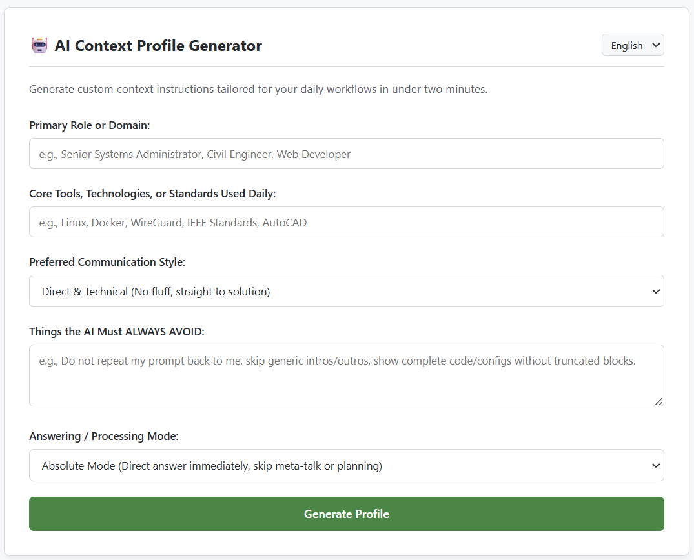

# 🤖 AI Context Profile Generator

An interactive, open-source tool that helps professionals create precise, high-leverage
context profiles and custom instructions for AI assistants like ChatGPT, Claude, and Gemini.

[](https://opensource.org/licenses/MIT)
[](CONTRIBUTING.md)
[](https://hgolshan.github.io/ai-context-generator/)

**➡️ [Try it live](https://hgolshan.github.io/ai-context-generator/)** — no install, no signup, nothing leaves your browser.

---

## 📌 Project Overview

Most people use AI models on default settings and get generic, overly cautious, or
needlessly verbose answers. Modern models perform dramatically better when given
background context — but writing effective system instructions by hand is slow and
most users never get around to it.

**AI Context Profile Generator** fixes this with a lightweight interactive form. It asks
targeted questions about your role, tools, expertise level, and preferred output format,
then generates a tailored, copy-pasteable context profile you can drop straight into your
AI platform's settings.



---

## 📄 Sample Output

<details>
<summary><b>Click to see a generated profile</b></summary>

```markdown
## About Me
Senior Network Engineer at a regional ISP. I design and maintain
multi-vendor enterprise backbone infrastructure.

## My Stack
Cisco IOS-XE, Juniper Junos, Arista EOS, Ansible, Python, NetBox

## My Expertise Level
Expert. Assume deep familiarity with BGP, OSPF, MPLS, and VRF internals.
Do not explain fundamentals unless I ask.

## How to Respond
- Lead with the answer. No preambles, no "Great question!"
- Provide complete, runnable configurations — never placeholder fragments
- Explicitly flag any command that is service-impacting or destructive
- Prefer CLI over GUI instructions
- When multiple valid approaches exist, state your recommendation and why

## Constraints
- Never invent command syntax. If unsure, say so
- Cite vendor documentation versions when behaviour is version-specific
```
</details>

---

## 🔬 Before / After

| Prompt | Default AI | With Generated Profile |
|---|---|---|
| *"How do I filter BGP routes?"* | Explains what BGP is, offers a generic `route-map` snippet with placeholders, adds three safety disclaimers. | Returns a complete prefix-list + route-map config for the correct platform, flags the `clear bgp` soft-reset as impacting, notes the version caveat. |

---

## ✨ Features

- **⚡ Fast** — a complete profile in under two minutes
- **🎯 Role presets** — IT & systems administration, network engineering, software development, civil / mechanical / electrical engineering, language learning, and
  management, with more added over time
- **🔒 Private by design** — 100% client-side. No backend, no analytics, no network
  requests. Verify it yourself in DevTools → Network
- **🌍 Multi-language** — [English and Persian, with full RTL support], extensible via
  simple JSON files in `/locales`
- **🌐 Zero dependencies** — pure HTML / CSS / JS. No build step, no `npm install`
- - **🧠 Reasoning modes** — go beyond tone. Choose how the AI *thinks*:
  Absolute (answer first, zero preamble), Chain-of-Thought (show reasoning), Socratic (guiding questions), or Critical Review (surface edge cases and flaws before proposing)

---

## 🚀 How to Use

1. Open the **[live generator](https://hgolshan.github.io/ai-context-generator/)**.
2. Fill in your role, key tools, communication style, and any hard rules
   (e.g. *"skip introductions"*, *"always give complete configs"*).
3. Click **Generate Profile**.
4. Click **Copy to Clipboard**.
5. Paste it into your platform's instruction field.

### Where to paste it

| Platform | Location | Notes |
|---|---|---|
| **ChatGPT** | Settings → Personalization → Custom Instructions | Tight character limit per box — see below |
| **Claude** | Project Instructions, or Settings → Personal Preferences | Generous limit; full profiles fit comfortably |
| **Gemini** | Saved Info / Gem instructions | — |
| **GitHub Copilot** | `.github/copilot-instructions.md` in your repo | Per-project, version-controlled |

> **⚠️ Note on length:** ChatGPT's custom instruction fields have a relatively small
> character limit and will silently truncate longer input. If your generated profile is
> long, either trim it or use the shorter output preset. Claude Projects and Copilot
> instruction files accept much longer profiles.

---

## 🛠️ Local Development

This is a zero-dependency static web app — no build tooling required.

1. Clone the repository:

   ```bash
   git clone https://github.com/hgolshan/ai-context-generator.git
   ```

2. Enter the project folder:

   ```bash
   cd ai-context-generator
   ```

3. Serve the directory over HTTP. A local server is required so `fetch()` can load the
   translation files in `/locales` — opening `index.html` directly via `file://` will
   trigger CORS errors.

   **Python 3:**

   ```bash
   python3 -m http.server 8000
   ```

   Then open <http://localhost:8000>.

   **Node.js:**

   ```bash
   npx serve
   ```

   **VS Code:** right-click `index.html` → *Open with Live Server*.

---

## 🗺️ Roadmap

- [ ] Per-platform output presets with a live character counter
- [ ] Save / load profiles as local JSON (versioned schema)
- [ ] Download as `.md`
- [ ] Additional role presets — research, editorial & journalism, design, legal, education
- [ ] Additional language packs

---

## 🤝 Contributing

Contributions are very welcome — new language packs, role presets, or refinements to the
prompt templates. Adding a language is the easiest place to start: copy an existing file
in `/locales`, translate the values, and open a PR.

Please read [CONTRIBUTING.md](CONTRIBUTING.md) first.

---

## 📄 License

MIT — see [LICENSE](LICENSE).
